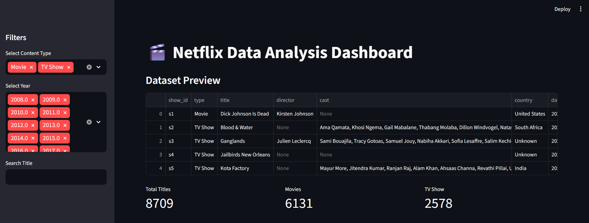
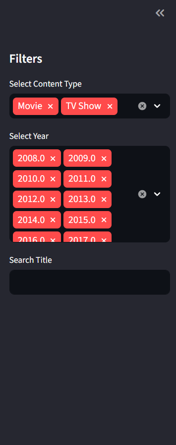
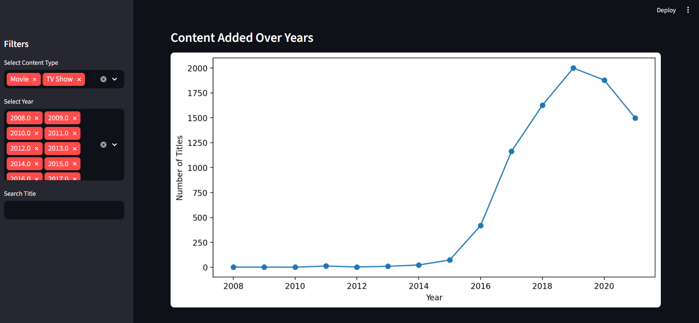
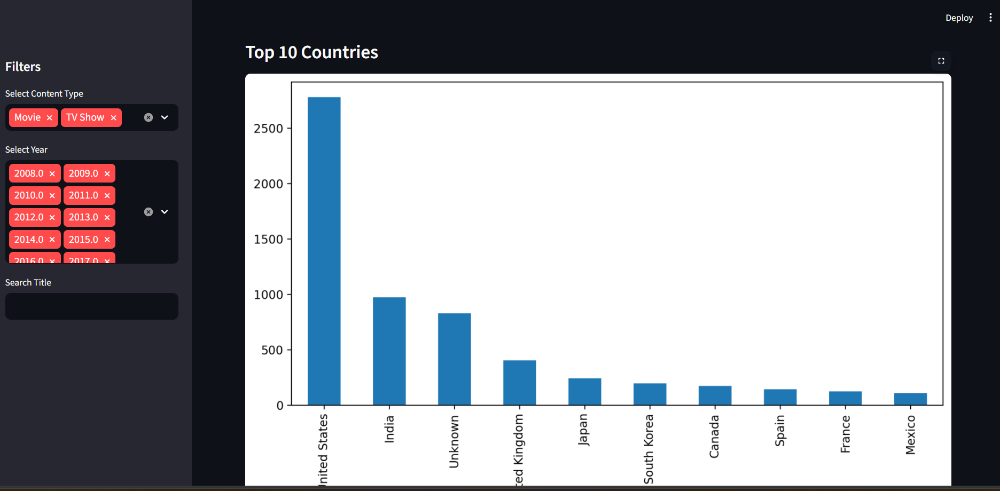
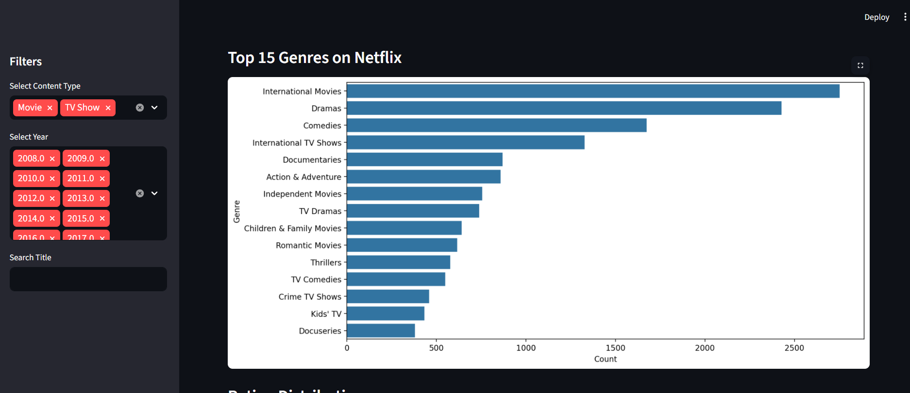
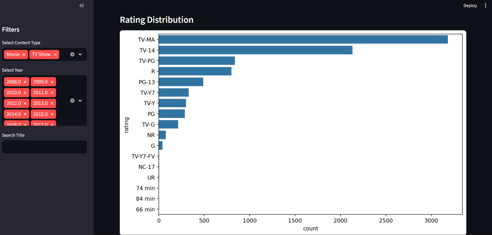
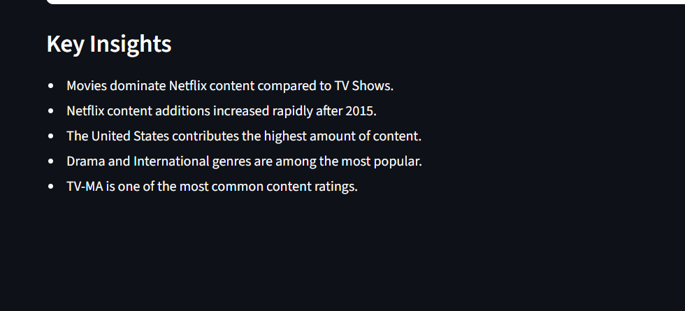

# 🎬 Netflix Data Analysis Dashboard

An interactive Netflix Data Analysis Dashboard built using Python and Streamlit to analyze movies and TV shows available on Netflix. The project focuses on content distribution, genre popularity, ratings analysis, and content growth trends through interactive visualizations.

## 🚀 Project Objectives

* Analyze Netflix content trends over time
* Identify popular genres and content categories
* Explore ratings distribution across titles
* Visualize country-wise content availability
* Provide actionable insights through an interactive dashboard

## ✨ Features

* Data cleaning and preprocessing using Pandas
* Interactive dashboard built with Streamlit
* Genre analysis and content distribution
* Ratings and release year analysis
* Country-wise content analysis
* Dashboard filtering and visual insights

## 🛠 Tools & Technologies

* Python
* Pandas
* Matplotlib
* Seaborn
* Streamlit

## 📊 Project Insights

* Analyzed content growth trends over the years
* Identified the most popular genres on Netflix
* Visualized content distribution across countries
* Explored ratings patterns and audience categories
* Compared movies and TV shows available on the platform

## 📷 Dashboard Preview

### 🎬 Netflix Dashboard

### 🎛️ Sidebar Filter

### 📈 Content Added Over Years

### 🌍 Top 10 Countries

### 🎭 Top 15 Genres on Netflix

### ⭐ Ratings Analysis

### 💡 Key Insights

## 📁 Files Included

* app.py
* requirements.txt
* screenshots/

## 🎯 Skills Demonstrated

* Data Cleaning
* Exploratory Data Analysis (EDA)
* Data Visualization
* Dashboard Development
* Streamlit Application Development
* Analytical Thinking
